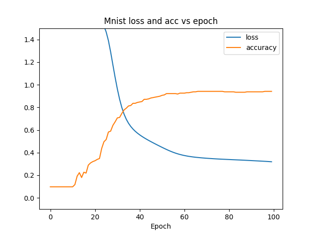
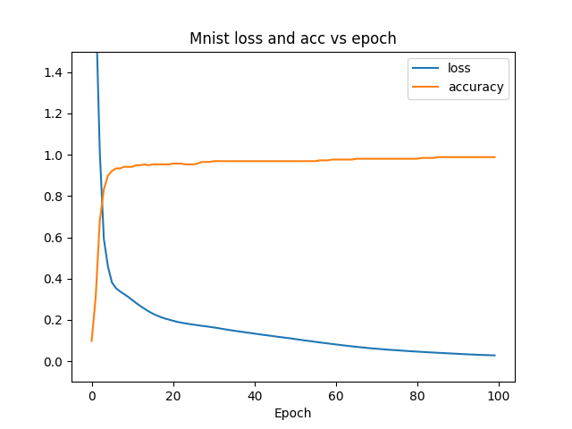

# Report Lab 1 - Philip Policki 24.10.23

## Neural network implementation

### Network class

This nn class is written in a way to easily modify hidden layers with the same dimensionality

```python
class NeuralNetwork:
    def __init__(
        self,
        *,
        input_dim: int,
        hidden_dim: int,
        output_dim: int,
        number_of_hidden_layers: int,
    ):
        pass


    def forward(self, inputs: NDArray) -> NDArray:
        pass

    def backwards(self, d_loss: NDArray):
        pass
```


### Layer class
For this assignment I have implemented a single layer type mainly the fully connected dense layer.
The implemented properties allow for backpropagation to be self contained on the layer class instance,
hence-why all the gradients and recent forward pass input and output data are saved on the instance.  


```python
class DenseLayer(BaseLayer):
    def __init__(
        self,
        input_count: int,
        neurons_count: int,
        weights_initializer: Type[BaseInitializer] = HomogenousRandomInitializer,
    ):
        self.neurons_count = neurons_count
        self.input_count = input_count
        self.initializer = weights_initializer(np.array([self.input_count, self.neurons_count]))

        self.weights = self.initializer.initialize()
        self.biases = np.zeros((1, self.neurons_count))

        self.input = np.zeros((1, self.input_count))
        self.output = np.zeros((1, self.neurons_count))

        self.d_weights = np.zeros((1, self.neurons_count))
        self.d_bias = np.zeros((1, self.neurons_count))
        self.d_inputs = np.zeros((1, self.input_count))
```


### Activation functions

2 Activation functions were implemented for this task ReLU and Softmax

```python
class ReLU(BaseActivationFunction):
    def forward(self, inputs: NDArray) -> NDArray:
        self.input = inputs
        self.output = np.maximum(0, inputs)

        return self.output

    def backward(self, d_values: NDArray) -> None:
        self.d_inputs = d_values.copy()

        # Zero the gradient for negative values
        self.d_inputs[self.input <= 0] = 0


class SoftMax(BaseActivationFunction):
    def forward(self, inputs: NDArray) -> NDArray:
        exponential_values = np.exp(inputs - np.max(inputs, axis=1, keepdims=True))

        probabilities = exponential_values / np.sum(exponential_values, axis=1, keepdims=True)

        self.output = probabilities

        return self.output

    def backward(self, d_values: NDArray) -> None:
        d_inputs = np.empty_like(d_values)

        for idx, (output, d_value) in enumerate(zip(self.output, d_values)):
            # Flatten output
            output = output.reshape(-1, 1)

            jacobian_matrix = np.diagflat(output) - np.dot(output, output.T)

            d_inputs[idx] = np.dot(jacobian_matrix, d_value)

        self.d_inputs = d_inputs
```


### Weight initializers
Here the default implementation was a homogenous distribution initialized, however for the network to work an additional He initializer was implemented (here called the GeohotInitializes)


```python
class HomogenousRandomInitializer(BaseInitializer):
    def initialize(self) -> NDArray:
        return self.scale * np.random.rand(*self.shape)


class GeohotInitializer(BaseInitializer):
    """
        This is stolen from George Hotz's livestream about nns from scratch,
         he has also blessed us with this knowledge from his jupyter


    https://github.com/geohot/ai-notebooks/blob/master/mnist_from_scratch.ipynb

    # protip: if you like accuracy like 96 not like 93, next time through the notebook, consider
    # CHAD MODE WEIGHT INIT WITH NUMPY
    # instead of virgin torch init mode
    # TODO: why is torch linear init bad?

    """

    def initialize(self) -> NDArray:
        return np.random.uniform(
            -1.0,
            1.0,
            size=(self.shape[0], self.shape[1]),
        ) / np.sqrt(self.shape[0] * self.shape[1])
```


### Mini batch GD
Although named suboptimally as it is an optimizer + a minibatch implementation
it implements a basic SGD optimizer with only a learning rate hyperparameter (momentum and other more sophisticated were skipped for simplicity)


```python
class PhilipOptimizer:
    def __init__(self, network: NeuralNetwork, *, learning_rate: float, batch_size: int, epochs: int):
        self.network = network
        self.learning_rate = learning_rate
        self.batch_size = batch_size
        self.epochs = epochs

        self.accuracy_fn = Accuracy()
        self.loss_fn = CategoricalCrossEntropyLoss()

        self.losses = []
        self.accs = []

    def run_optimize(self, x: NDArray, y: NDArray):
        for epoch in range(self.epochs):
            self._run_optimize(x, y, epoch)

    def _run_optimize(self, x: NDArray, y: NDArray, epoch: int):
        batch_count = x.shape[0] // self.batch_size

        for batch_no in trange(batch_count):
            start_idx = batch_no * self.batch_size
            end_idx = start_idx + self.batch_size

            x_window = x[start_idx:end_idx]
            y_window = y[start_idx:end_idx]

            predictions = self.network.forward(x_window)

            acc = self.accuracy_fn.calculate(predictions, y_window)
            loss = self.loss_fn.calculate(predictions, y_window)

            self.loss_fn.backward(predictions, y_window)

            self.network.backwards(self.loss_fn.d_inputs)

            self._apply_optimization()

        print(f"{epoch}  --  acc[{acc:.3f}] - loss[{loss:.3f}]")
        self.losses.append(loss)
        self.accs.append(acc)

    def _apply_optimization(self):
        for layer in self.network.layers:
            layer.weights += -self.learning_rate * layer.d_weights
            layer.biases += -self.learning_rate * layer.d_bias
```

### Design decisions
For the whole forward and backward pass the network was designed to accept a tensor of values to compute forwards and backwards pass in parallel on in one operation


## Lessons and observations from implementation.

Selecting a proper weights initialization for a given activation functino is extremely crucial,
as for example doing a homogenous distribution without any other regularization for relu causes it to be highly unstable
and will result in exploding gradient and NaN's breaking all the underlying mathematics.


Applying optimizations should only add to the existing weights and not just replace them (this obviously causes the network to not learn and in general be terrible)


## Model training
### Affnist
Attempts on training anything on the affnist dataset using just the forward fully connected network resulted in a great failure.
The model did not learn anything regardless of the architecture. I started from a `1600 x (800 * 1) x 10` network and ended on `1600 x (800 * 10) x 10`,
as well as attempts to increase the network in the hidden layers with the same amount of layers

Each of the permutations that I tried was trained for about 10 epochs (which already took some) and the accuracy and loss values never changed much
and oscillated around `acc: 0.109 delta=0.01` and `loss: 2.3 delta=0.1`


### Mnist
Training mnist was much more successful on a much smaller network of `768 x 128 x 10` already managed to achieve a close to 1 in sample accuracy albeit with a relatively high loss
for this example the learning rate was set to `10e-4`




After retraining the same architecture while changing only the learning rate to `10e-3` drastically improves the initial accuracy growth as well as lowers the loss, which means that we hit a much better minimum with loss about 10x smaller
